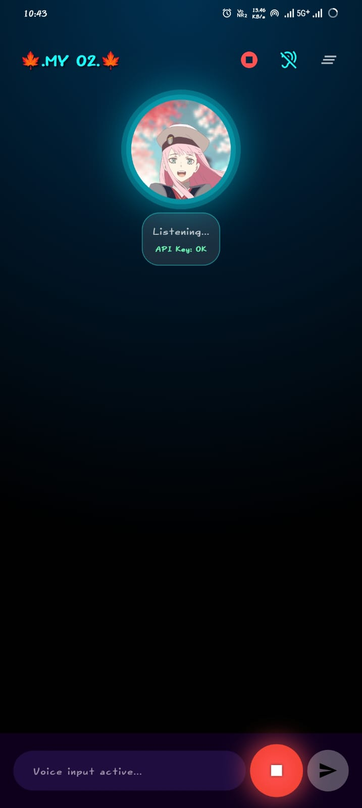
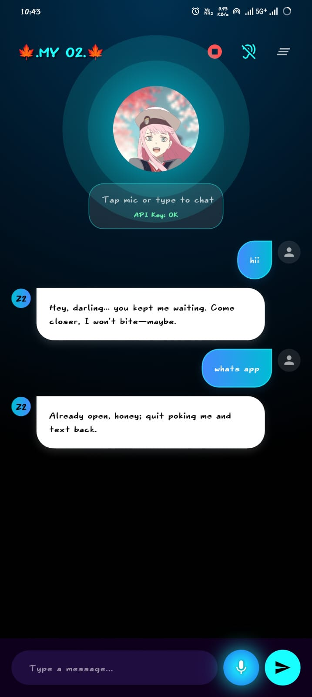
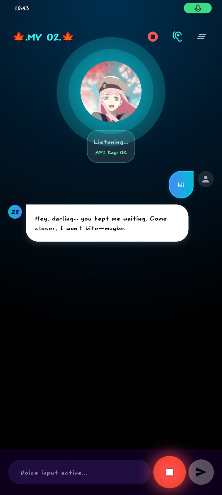

🌸 Anime Waifu Mobile App

  
 
     

🎀 Banner

  

💗 Logo

  

🌟 Overview

Anime Waifu Mobile App is a beautifully designed Flutter application that fetches and displays anime waifu images with smooth animations, modern UI, and fast API performance.

Built for anime lovers who want a cute, fun, and aesthetic mobile experience 💖

✨ Features

🎴 Beautiful waifu gallery

🎲 Random waifu generator

🎯 Tag-based filtering (cute, angry, cool, etc.)

⚡ Fast performance with API integration

🔮 Flutter animations (fade, shimmer, slide)

📱 Android & iOS support

🤍 Minimal and aesthetic UI

🛠️ Tech Stack

  

Flutter

Dart

REST APIs

Environment variables (.env)

Modern UI widgets

⚡ Getting Started
📦 Prerequisites

You need:

Flutter SDK

Android Studio / VS Code

A device or emulator

🔧 Installation
# 1️⃣ Clone the repository
git clone https://github.com/Sujit-O2/O2_Anime_Waifu-Mobile-App.git

# 2️⃣ Navigate into the directory
cd O2_Anime_Waifu-Mobile-App

# 3️⃣ Install dependencies
flutter pub get

# 4️⃣ Run the app
flutter run

🔑 Environment Setup

Create a .env file:

GROQ_API_KEY=your_groq_key
SENDGRID_API_KEY=your_sendgrid_key

🚫 Do NOT commit this file.

📁 Project Structure
lib/
 ├── ApiCall.dart          # API logic
 ├── main.dart             # Entry point
 ├── tts.dart              # text to speech
 ├── stt.dart              # speech to text
android/
ios/

📸 Animated UI Previews

    

🌈 Demo Screens (Add your real screenshots later)
📱 Home Screen
📱 Random Waifu Screen
📱 Tag-Based Waifu Selection
📱 Settings / UI Effects

🏗️ Roadmap

 Add more waifu APIs

 Add download button

 Enable favorites system

 Cloud sync

 Add AI chat with waifu (Groq-based)

 Add Lottie animations

🤝 Contributing

Pull requests are welcome!
Feel free to open issues or suggest features.

📜 License

MIT License — free to use & modify.

💖 Support the Project

  

If you enjoyed this project, please ⭐ the repo!