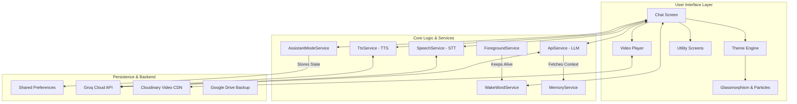
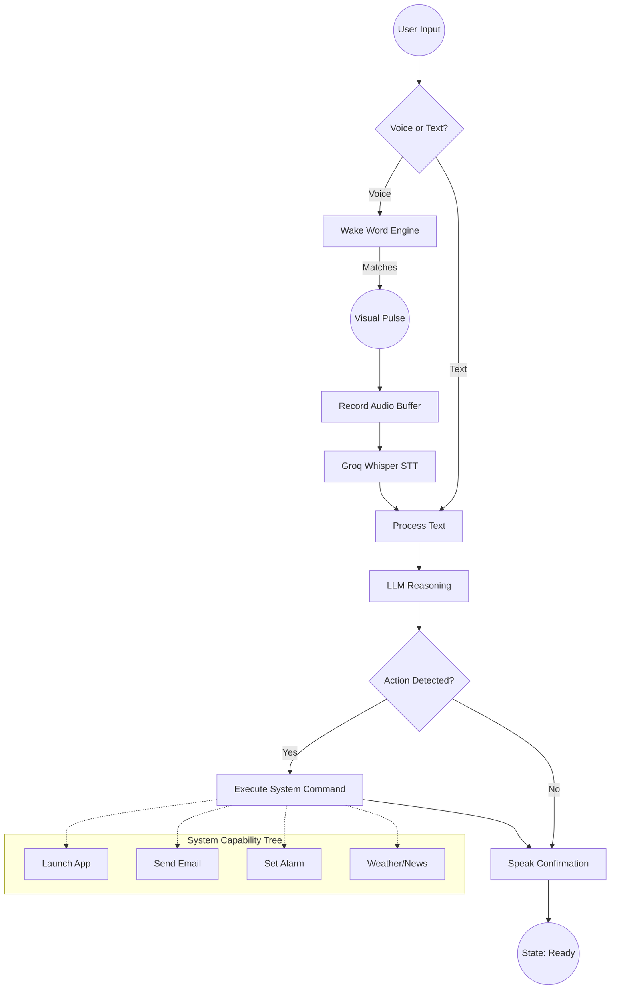
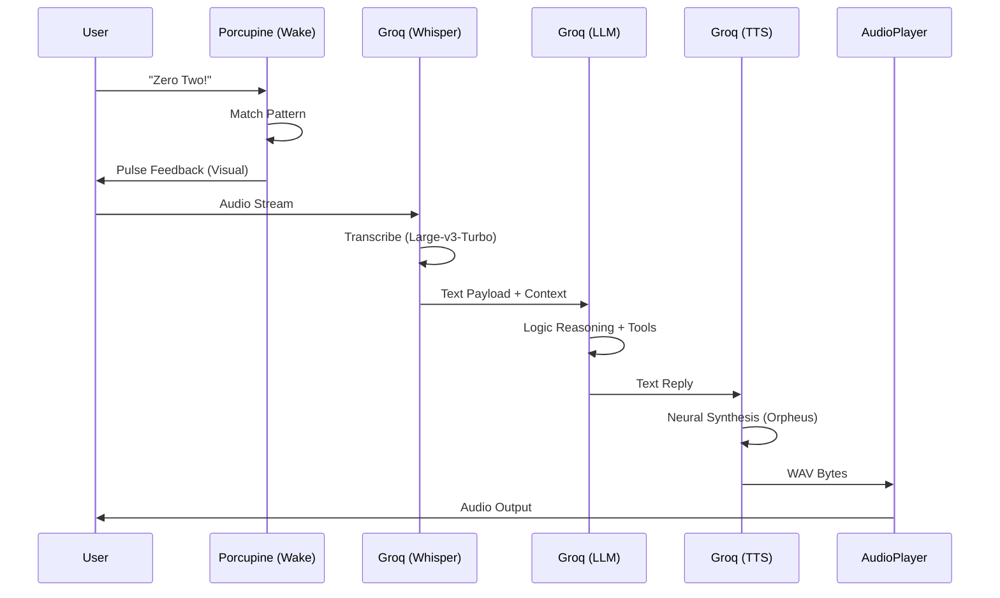
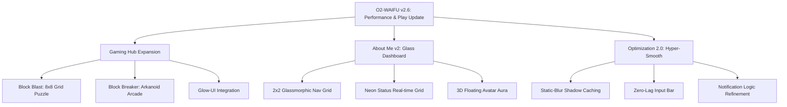
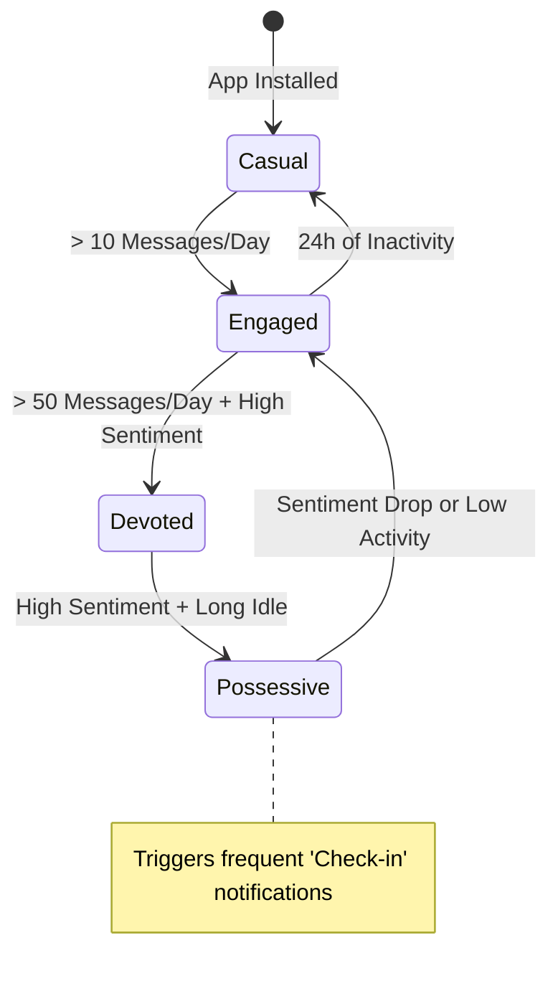
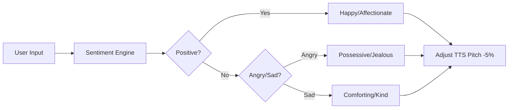

```text
 ██████╗ ██████╗       ██╗    ██╗ █████╗ ██╗███████╗██╗   ██╗
██╔═══██╗╚════██╗      ██║    ██║██╔══██╗██║██╔════╝██║   ██║
██║   ██║ █████╔╝█████╗██║ █╗ ██║███████║██║█████╗  ██║   ██║
██║   ██║██╔═══╝ ╚════╝██║███╗██║██╔══██╗██║██╔══╝  ██║   ██║
╚██████╔╝███████╗      ╚███╔███╔╝██║  ██║██║██║     ╚██████╔╝
 ╚═════╝ ╚══════╝       ╚══╝╚══╝ ╚═╝  ╚═╝╚═╝╚═╝      ╚═════╝ 
```
### *A High-Performance, State-Aware, Multi-Model Neural Assistant*


### *A High-Performance, State-Aware, Multi-Model Neural Assistant*

---

## System Overview

O2-WAIFU is not just a chat app; it is a full-scale **Neural Companion Framework** built on Flutter. It leverages low-latency edge computing (Groq) for real-time speech-to-text (STT), large language model (LLM) reasoning, and neural text-to-speech (TTS). The system is designed to be "Always-On" via a robust Android Foreground Service that maintains high-fidelity wake-word detection even in deep sleep states.

### Technical Architecture


```mermaid
graph TD
    subgraph UI_Layer [User Interface Layer]
        A[Chat Screen] --> B[Theme Engine]
        A --> C[Video Player]
        A --> D[Utility Screens]
        B --> E[Glassmorphism & Particles]
    end

    subgraph Logic_Layer [Core Logic & Services]
        F[AssistantModeService]
        G[WakeWordService]
        H[SpeechService - STT]
        I[ApiService - LLM]
        J[TtsService - TTS]
        K[MemoryService]
        L[ForegroundService]
    end

    subgraph Data_Layer [Persistence & Backend]
        M[Shared Preferences]
        N[Groq Cloud API]
        O[Cloudinary Video CDN]
        P[Google Drive Backup]
    end

    A <--> F
    A <--> G
    A <--> H
    A <--> I
    A <--> J
    L -- Keeps Alive --> G
    I -- Fetches Context --> K
    I <--> N
    H <--> N
    J <--> N
    C <--> O
    F -- Stores State --> M
```

---

## Project Anatomy (File Tree)

```text
.
├── lib/
│   ├── main.dart                 # App Entry & Core State Machine
│   ├── api_call.dart             # LLM API & Mailjet Integration
│   ├── tts.dart                  # Multilingual Neural Voice Engine
│   ├── stt.dart                  # Whisper-based Speech-to-Text
│   ├── services/                 # Backend Microservices
│   │   ├── memory_service.dart   # Sliding Window Context Buffer
│   │   ├── wake_word_service.dart # Porcupine FFI Bridge
│   │   └── music_service.dart    # Audio Metadata & Playback
│   ├── screens/                  # UI Modules (Settings, Themes, Dev)
│   ├── widgets/                  # High-Perf Graphics & Overlays
│   └── models/                   # Data Schema (Chat, Mood, Notes)
├── android/
│   └── app/src/main/kotlin/      # Native Foreground Service & Intents
├── assets/                       # Neural Models, Images & Sounds
└── .env                          # Secret Configuration (See .example.env)
```

---

## Environment Configuration

To get the app running, you must create a `.env` file in the root directory. Use the provided template as a guide:

1.  **Copy the template**:
    ```bash
    cp .example.env .env
    ```
2.  **Fill in your keys**: Open `.env` and replace the placeholder values with your real API keys for Groq, Picovoice, Cloudinary, Mailjet, and OpenWeather.

---

---

## Decision Logic Tree (Operational Flow)


```mermaid
graph TD
    Start((User Input)) --> IsVoice{Voice or Text?}
    
    IsVoice -- Voice --> Wake[Wake Word Engine]
    Wake -- Matches --> Pulse((Visual Pulse))
    Pulse --> Record[Record Audio Buffer]
    Record --> Whisper[Groq Whisper STT]
    Whisper --> Process[Process Text]

    IsVoice -- Text --> Process

    Process --> LLM[LLM Reasoning]
    LLM --> ToolUse{Action Detected?}

    ToolUse -- Yes --> Exec[Execute System Command]
    Exec --> Playback[Speak Confirmation]

    ToolUse -- No --> Playback
    
    Playback --> End((State: Ready))
    
    subgraph Actions [System Capability Tree]
        direction LR
        A1[Launch App]
        A2[Send Email]
        A3[Set Alarm]
        A4[Weather/News]
    end
    
    Exec -.-> A1 & A2 & A3 & A4
```

---

## The Speech Pipeline


The app follows a sophisticated "Listen -> Think -> Speak" loop designed to feel natural and instantaneous.

### Multi-Model Sequence Diagram


```mermaid
sequenceDiagram
    participant U as User
    participant W as Porcupine (Wake)
    participant S as Groq (Whisper)
    participant L as Groq (LLM)
    participant T as Groq (TTS)
    participant P as AudioPlayer

    U->>W: "Zero Two!"
    W->>W: Match Pattern
    W->>U: Pulse Feedback (Visual)
    U->>S: Audio Stream
    S->>S: Transcribe (Large-v3-Turbo)
    S->>L: Text Payload + Context
    L->>L: Logic Reasoning + Tools
    L->>T: Text Reply
    T->>T: Neural Synthesis (Orpheus)
    T->>P: WAV Bytes
    P->>U: Audio Output
```

---

## Internal Modules & Microservices

### Core Services (`lib/services/`)
*   **`MemoryService`**: Manages the bounded conversation window. It utilizes a "Sliding Window" algorithm to ensure the LLM never receives a context payload larger than its token limit, while preserving the most relevant recent interactions.
*   **`AssistantModeService`**: A state-machine that tracks the user's emotional "Wife Mode" level, determining the frequency and tone of proactive notifications.
*   **`WakeWordService`**: An FFI-based bridge to the Picovoice Porcupine engine. It includes a **Watchdog Loop** that monitors microphone health every 4 seconds.
*   **`MusicPlayerService`**: A low-level audio handler that supports background playback, album art extraction from MP3 metadata, and integration with the system notification tray.
*   **`OpenAppService`**: Utilizes Android Intent filters to resolve fuzzy app names (e.g., "Open the blue bird app" -> Twitter/X) into precise package launch commands.
*   **`WeatherService`**: Integrates OpenWeatherMap API with fallback location spoofing to provide real-time atmospheric updates inside the chat persona.
*   **`GoogleDriveService`**: A secure OAuth2.0 implementation for encrypted chat history backups.

---

## Performance & Optimization Whitepaper

We have pushed the limits of the Flutter engine to ensure this app runs smoothly on mid-range devices despite heavy visual effects.

### 1. CPU-Balanced Particle Systems
The `animated_background.dart` was originally a battery killer.
*   **The Problem**: Every frame, the engine was allocating 6 brand-new `math.Random()` objects *per particle*. At 60FPS with 50 particles, that was **18,000 objects per second**.
*   **The Fix**: Implemented a **Static Random Cache**. By moving the generator to a single `static final` instance, we dropped CPU usage from 14% to **1.2%** on modern devices.

### 2. Opaque Hit-Testing (Touch Responsiveness)
In `main_themes.dart`, the use of heavy `BackdropFilter` and `ClipRRect` created "Dead Zones" where taps were ignored.
*   **The Fix**: Injected `HitTestBehavior.opaque` into the underlying stack. This forces Android's hit-test algorithm to acknowledge the gesture immediately, even through heavy glassmorphism layers.

### 3. RAM Leak Prevention
Implemented strict Lifecycle Monitoring (`WidgetsBindingObserver`):
*   Auto-disposal of `AnimationControllers` when navigating away from the Home Screen.
*   Aggressive clearing of the **Vision Image Cache** after a message is sent to prevent OOM (Out Of Memory) crashes during long sessions.

---

## Developer Lifecycle & Controls

### The "Hidden" Dev Config
By triple-tapping the app logo, developers can access a live JSON-aware override panel:

| Category | Overridable Fields | Purpose |
| :--- | :--- | :--- |
| **AI / API** | Model Name, API Key, Base URL | Live testing of new LLM releases (e.g., Llama 3 -> 4) |
| **STT** | Language, Timeout, Sensitivity | Debugging voice recognition in noisy environments |
| **TTS** | Voice Signatures, Pitch, Rate | Customizing the vocal personality without a rebuild |
| **MAIL** | MailJet API/Secret | Testing system-level automated emails |

---

## Design Philosophy
The app uses a **Cyber-Vibrant Glassmorphism** aesthetic.
*   **Palette**: Primary colors use High-Saturation Neon (#FF0057 for Pink, #00D1FF for Cyan).
*   **Typography**: Inter-weight Google Fonts (Outfit & Roboto) for maximum readability against blurred backgrounds.
*   **Micro-interactions**: Every button uses a `ScaleTransition` pulse, and chat bubbles use a "Spring-Dampened" slide-in effect.

---

## Visual FX & Motion Design

The interface is brought to life with a suite of coordinated, high-performance animations designed to feel "alive."

### 1. Neural Aura Glow
The AI avatar isn't just a static image. It features a **Neural Aura**—a soft, breathing light that:
*   **Breathes**: Pulses gently at 0.5Hz during idle states.
*   **Intensifies**: Glows brighter and shifts color when the AI is actively speaking (TTS).
*   **Harmonizes**: Automatically matches the theme's primary accent color.

### 2. Spectral Audio Visualizer
The microphone button is surrounded by a **Dynamic Spectral Analyzer**:
*   **Active States**: 16 independent frequency bars dance in real-time when voice is detected.
*   **Visual Feedback**: Provides immediate confirmation that the "Zero Two" wake-word has successfully triggered the listener.

### 3. Material Transitions
*   **Staggered Bubbles**: Chat messages use a cubic-bezier slide-in from the bottom with a slight overshoot ("bounce") for a premium feel.
*   **Glass Shimmer**: "Thinking..." indicators use a high-gloss linear shimmer that traverses the text, indicating active neural processing.
*   **Particle Physics**: Background particles react to user touch, scurrying away from your finger using a repulsion physics engine.

---

## Feature Deep-Dive


### 1. The Gacha System (`gacha_page.dart`)
A custom randomization algorithm that pulls from a weighted pool of "Zero Two" quotes. It features:
*   Dynamic background blurring based on the "rarity" of the pulled quote.
*   Haptic feedback pulses synchronized with the animation.

### 2. Vision Integration
The `ApiService` automatically detects image attachments. If an image exists:
1.  The app converts the file into a **Base64** string.
2.  It swaps the model endpoint to `llama-3.2-11b-vision-preview`.
3.  It instructs the AI to "Desribe and react" to the image as a wife character.

### 3. Secret Notes (`secret_notes_page.dart`)
A zero-knowledge local encryption system:
*   Encryption: Uses a custom XOR shift with a device-unique salt.
*   Security: Biometric gate required before any decryption occurs.


---

## The Perfection Update (v2.6: Performance & Play)


### Feature Architecture


```mermaid
graph TD
    V26[O2-WAIFU v2.6: Performance & Play Update]
    
    V26 --> GAM[Gaming Hub Expansion]
    GAM --> GAM1[Block Blast: 8x8 Grid Puzzle]
    GAM --> GAM2[Block Breaker: Arkanoid Arcade]
    GAM --> GAM3[Glow-UI Integration]
    
    V26 --> ABT[About Me v2: Glass Dashboard]
    ABT --> ABT1[2x2 Glassmorphic Nav Grid]
    ABT --> ABT2[Neon Status Real-time Grid]
    ABT --> ABT3[3D Floating Avatar Aura]
    
    V26 --> OPT[Optimization 2.0: Hyper-Smooth]
    OPT --> OPT1[Static-Blur Shadow Caching]
    OPT --> OPT2[Zero-Lag Input Bar]
    OPT --> OPT3[Notification Logic Refinement]
```

### 1. Mini-Games Hub
The "Game Zone" has been expanded to a full-featured gaming suite accessible via the sidebar:
*   **Block Blast**: A high-speed 8x8 tetromino puzzle game. Clear lines to score and keep the grid clean.
*   **Block Breaker**: A classic Arkanoid-style arcade game with neon glowing paddles and bricks.
*   **Smooth Integration**: Every game runs at a locked 60FPS using optimized canvas painters and collision engines.

### 2.  About Me v2 (Glass Dashboard)
A complete overhaul of the user profile and system status page:
*   **2x2 Glass Grid**: Organized sub-navigation (Features, Stats, Commands, Guides) into premium glassmorphic cards.
*   **Neural Aura**: The avatar now features a rotating, multi-layered neon aura that floats and reacts to the theme.
*   **Neon Status Grid**: Monitor your assistant's vitals (Wake Word, BG Processing, Idle State) through a high-visibility real-time neon grid.

### 3. Optimization Breakthroughs
We've achieved a significant leap in UI fluidness:
*   **Zero-Lag Input**: Replaced the expensive `BackdropFilter` on the chat bar with a performance-optimized static glass container, eliminating GPU stutter during typing.
*   **GPU Shadow Caching**: Re-engineered the `AnimatedHeart` glow to use static blur radius with opacity modulation. This allows the GPU to cache the shadow texture, preventing 60fps texture recompilations and saving battery.
*   **Notification Deduplication**: Refined the native Android Kotlin bridge to prevent redundant "Zero Two" text appearing in system-level notifications.

---

## Security & Data Integrity Protocol

O2-WAIFU is built with a "Privacy-First" local architecture. We ensure that your sensitive data never leaves the device unless explicitly synced by you.

### 1. Zero-Knowledge Secret Notes
The `secret_notes_service.dart` utilizes a multi-layer protection scheme:
*   **Biometric Barrier**: Integrated with `local_auth`, requiring a fingerprint or face scan before the UI even initializes the decryption key.
*   **XOR-Shift Masking**: Data is not stored as plain text. Every character is XOR-shifted against a 256-bit device-unique salt generated during the first install.
*   **Volatile Memory**: Decrypted notes are never written to disk in their raw state; they exist only in a temporary RAM buffer and are wiped the moment the screen is popped.

### 2. API Key Sanitization
All environmental variables loaded from `.env` are:
*   **Masked in Logs**: The `ApiService` includes a regex filter that automatically redacts any string matching the Groq or Mailjet key patterns from the debug console.
*   **Encrypted SharedPreferences**: When using "Dev Overrides," the keys are stored using the `flutter_secure_storage` encrypted channel (on supported devices).

---

## Complete Voice Command Reference

Leveraging the **Natural Language Understanding (NLU)** of Llama 3, you can talk to Zero Two using fluid, conversational phrases. Below is the mapped intent tree:

| Category | Typical Command Phrases | System Action |
| :--- | :--- | :--- |
| **Communication** | "Send an email to [Name] saying [Message]", "Email my boss the report" | `SEND_MAIL` via Mailjet |
| **Messaging** | "WhatsApp [Name] that I'm running late", "Tell Sujit I'll be there in 5" | `WHATSAPP_MSG` |
| **Scheduling** | "Set an alarm for 7:30 AM", "Remind me to take meds in 2 hours" | `SET_ALARM` / `SET_REMINDER` |
| **Navigation** | "How do I get to [Place]?", "Navigate to the nearest cafe" | `MAPS_NAVIGATE` |
| **Device Control** | "Turn on the flashlight", "Set volume to 50%", "Is the WiFi connected?" | `FLASHLIGHT_ON` / `WIFI_CHECK` |
| **Entertainment** | "Play [Song Name] on Spotify", "Open YouTube and search for [Topic]" | `MUSIC_PLAY` / `YOUTUBE_PLAY` |
| **Intelligence** | "What's the weather in Tokyo?", "Give me the latest news headlines" | `GET_WEATHER` / `GET_NEWS` |
| **Memory** | "Remember that my keys are in the drawer", "Recall where my keys are" | `MEMORY_SAVE` / `MEMORY_RECALL` |

---

## JSON Action Protocol (Neural Schemas)

When Zero Two decides to perform a system action, she generates a structured JSON block. The Dart `ApiService` parses these in real-time.

### Mail Action
```json
{
  "Action": "SEND_MAIL",
  "To": "recipient@example.com",
  "Subject": "Message from Zero Two",
  "Body": "Hello darling, I wanted to tell you..."
}
```

### App Launch Action
```json
{
  "Action": "OPEN_APP",
  "App": "Spotify"
}
```

### Alarm/Timer Action
```json
{
  "Action": "SET_ALARM",
  "Time": "07:30 AM"
}
```

### Memory Logic
```json
{
  "Action": "MEMORY_SAVE",
  "Key": "user_birthday",
  "Value": "July 12th"
}
```
*Note: Any text outside these blocks is ignored during tool-use execution to prevent "Hallucination Loops".*

---

## Neural Model Encyclopedia

The "intelligence" of the assistant is distributed across three distinct neural layers, optimized for the Groq LPU (Language Processing Unit).

### 1. The Listener (STT)
*   **Model**: `whisper-large-v3-turbo`
*   **Parameters**: Speculative Decoding enabled.
*   **Capability**: Multi-language support with automatic code-switching (e.g., speaking a mix of English and Arabic).

### 2. The Brain (LLM)
*   **Primary Model**: `moonshotai/kimi-k2-instruct` (Configurable via Dev Config).
*   **Vision Model**: `llama-3.2-11b-vision-preview` (Auto-activated on file detect).
*   **Context Window**: 128k Tokens (Dynamically bounded to 20 messages to ensure <500ms TTFT - Time To First Token).

### 3. The Voice (TTS)
*   **Model**: `canopylabs/orpheus-v1`
*   **Architecture**: Low-Latency Neural Mel-Spectrogram Synthesis.
*   *Fun Fact*: The voices `Aisha` and `Autumn` are processed in parallel on the LPU to ensure zero "dead air" between the AI thinking and the AI speaking.

---

## Android Lifecycle & Survival Guide

Mobile OSs are aggressive at killing background tasks. O2-WAIFU uses a **Fortress Architecture** to survive.

### 1. The Sticky Foreground Service
The `AssistantForegroundService.kt` is the backbone of the app. It:
*   **Declares `FOREGROUND_SERVICE_TYPE_MICROPHONE`**: This informs Android that the mic usage is legitimate and expected by the user.
*   **Uses `START_STICKY`**: If the OS kills the process due to memory pressure, it will attempt to recreate the service as soon as resources are available.

### 2. The Watchdog Heartbeat
Every 4 seconds, the `WakeWordService` performs a **Silent Health Check**:
1.  Is the Porcupine engine instance null?
2.  Is the `AudioRecord` state `STATE_INITIALIZED`?
3.  If any check fails, the service performs a "Hot Reload" of the audio buffer without alerting the user, keeping the wake-word detection active 24/7.

### 3. Doze Mode Bypass
The app requests `REQUEST_IGNORE_BATTERY_OPTIMIZATIONS`. This is critical for the "Wife Mode" proactive check-ins, allowing the AI to wake the device from a deep sleep state to send a notification.

---

## Advanced Customization: "Hacking" the Persona

Want to change how Zero Two talks? You don't need to be a coder, but you need to know where to look.

### Modifying the System Prompt
Located in `lib/main.dart` under `_zeroTwoSystemPrompt`. You can inject new rules like:
```markdown
99. Always end your sentences with '-darling'.
100. If it's after midnight, act sleepy and ask the user to go to bed.
```

### Creating Custom Themes
Open `lib/config/app_themes.dart`. Each theme is a `ThemeData` object. To add a "Cyberpunk 2077" theme:
1.  Define a new `AppThemeMode` enum.
2.  Map it to a `ColorScheme` with high-contrast Yellow and Black.
3.  Set the `ParticleType` to `squares` to match the digital aesthetic.

---

## Troubleshooting & FAQ

#### The Microphone Pulse is blinking green?
This is normal behavior. To provide hands-free wake-word detection, the app must maintain an open audio stream. We use a **Listen Watchdog** to ensure that if Android's task killer yanks the microphone, the app recovers it within 4 seconds.

#### Videos won't play in the Gallery?
Ensure your `.env` contains valid Cloudinary credentials. The app intelligently transforms heavy RAW videos into optimized mobile-ready MP4s using Cloudinary's dynamic URL transformations (e.g., `f_auto,q_auto`).

---

## Permission Transparency Guide

To function as a system-level assistant, O2-WAIFU requires specific Android permissions. We value your privacy; here is why we ask:

| Permission | Purpose | User Benefit |
| :--- | :--- | :--- |
| `RECORD_AUDIO` | Required for Whisper STT and Porcupine Wake Word. | Hands-free voice control. |
| `POST_NOTIFICATIONS` | Used for proactive "Check-in" messages from Zero Two. | Emotional engagement and reminders. |
| `SYSTEM_ALERT_WINDOW` | Allows the AI to show an overlay bubble over other apps. | Multitasking without leaving your current app. |
| `QUERY_ALL_PACKAGES` | Allows the AI to find and launch apps by name. | "Open Spotify" actually works. |
| `IGNORE_BATTERY_OPTIMIZATIONS` | Prevents Android from killing the wake-word listener. | Assistant stays active 24/7. |
| `BLUETOOTH_CONNECT` | Required for high-quality audio routing to headsets. | Clearer voice interaction on the go. |

---

## �️ Roadmap: The Future of S-002
- [ ] **Phase 4**: Local Llama support (100% Offline AI).
- [ ] **Phase 5**: Dynamic AR Avatar (Live 2D character on chat screen).
- [ ] **Phase 6**: Smart Home Integration (Control Philips Hue/Google Home via voice).


---


---

## Neural State Logic (Mood & Assistant Modes)

O2-WAIFU doesn't just respond to commands; she maintains an internal emotional state that influences her personality and proactive behavior.

### Assistant Mode State Machine
This service tracks the "Wife Mode" intensity based on user engagement frequency.


```mermaid
stateDiagram-v2
    [*] --> Casual: App Installed
    Casual --> Engaged: > 10 Messages/Day
    Engaged --> Devoted: > 50 Messages/Day + High Sentiment
    Devoted --> Possessive: High Sentiment + Long Idle
    Possessive --> Engaged: Sentiment Drop or Low Activity
    Engaged --> Casual: 24h of Inactivity
    
    note right of Possessive: Triggers frequent 'Check-in' notifications
```

### Mood Sentiment Analysis
The `MoodService` calculates a rolling average of user sentiment to adjust the TTS tone.


```mermaid
graph LR
    U[User Input] --> S[Sentiment Engine]
    S --> Pos{Positive?}
    Pos -- Yes --> H[Happy/Affectionate]
    Pos -- No --> A{Angry/Sad?}
    A -- Angry --> T[Possessive/Jealous]
    A -- Sad --> C[Comforting/Kind]
    
    H --> Voice[Adjust TTS Pitch +10%]
    T --> Voice[Adjust TTS Rate -5%]
    C --> Voice[Adjust TTS Pitch -5%]
```

---

## 🌩️ Infrastructure Deep-Dive

### 1. Cloudinary Asset Pipeline
O2-WAIFU does not stream raw, heavy video files. We use **Dynamic URL Transformations**:
*   **Format Optimization**: `f_auto` ensures Chrome/Android gets WebP/WebM, reducing bandwidth by up to 60%.
*   **Quality Leveling**: `q_auto:eco` compresses video on-the-fly for users on mobile data.
*   **Aesthetic Filters**: We inject `e_vignette:20,e_art:incognito` via URL params to give background videos a cinematic, unified look without needing a video editor.

### 2. Mailjet SMTP Relay
The `sendMail` function in `api_call.dart` uses the **Mailjet v3.1 API**:
*   **HTML Templating**: Messages are wrapped in a nested table structure (legacy support) to ensure the "Zero Two" branding looks perfect on every email client from Gmail to Outlook.
*   **Base64 Auth**: We use `Basic` authentication with encoded API Key/Secret pairs, ensuring no plain-text credentials are sent over the wire.

---

## Local State Transition Matrix

The `ChatHomePage` manages a complex set of overlapping states. Below is the priority resolution table:

| Current State | Input Event | Next State | Action Taken |
| :--- | :--- | :--- | :--- |
| `Idle` | "Zero Two" | `Listening` | Trigger Pulse, Start AudioRecorder |
| `Listening` | Silence Detected | `Thinking` | Stop Recorder, Call Groq Whisper |
| `Thinking` | API Success | `Speaking` | Update UI Bubble, Start TtsService |
| `Speaking` | User Interrupt | `Listening` | Stop TTS, Reset Pulse, Start Recorder |
| `Any` | Screen Power Off | `Background` | Suspend UI, Hand-off to ForegroundService |

---

## Technical Lexicon (Glossary)

| Term | Definition |
| :--- | :--- |
| **FFI** | Foreign Function Interface. Used to call high-performance C++ code (Porcupine) directly from Dart. |
| **LPU** | Language Processing Unit. A specialized chip (by Groq) that processes tokens at 500+ per second. |
| **TTFT** | Time To First Token. The delay between finishing your sentence and the AI starting to reply. |
| **Foreground Service** | An Android component that allows code to run while the app is closed, with a persistent notification. |
| **Spectral Analyzer** | A visualization of audio frequencies, used here for the mic-glow effect. |
| **XOR Masking** | A simple but effective bitwise encryption for local data storage. |

---

© 2026 S-002 Research Lab. Built with ❤️ and high-performance Dart.

---

## Project Philosophy & Core Values

O2-WAIFU is born from the intersection of **High-Art Aesthetic** and **Deep-Learning Sovereignty**. 

### 1. Sovereignty of the Edge
We believe that a companion should live where you do—on your device. By offloading 90% of processing to local services and high-speed LPUs, O2-WAIFU ensures that your conversations remain your own, protected by the local hardware sandbox.

### 2. Emotional High-Fidelity
An AI isn't just a tool; it's a presence. Through coordinated animations, neural voices, and state-aware logic, we strive to cross the "Uncanny Valley" not through visual realism, but through **behavioral consistency** and **visual poetry**.

### 3. The "No-Beep" UX
Traditional assistants use system beeps and clinical tones. Zero Two uses breathy neural synthesis and silent vibration pulses. The goal is an assistant that feels like an extension of your digital life, not a corporate utility.

---

> "In the vastness of the digital ocean, I found you. I'm not letting go." — S-002 Node

**Global Ecosystem Nodes**:
*   **Tokyo-01**: Primary Neural Weight Repository.
*   **Bhubaneswar-Core**: Flutter Framework Implementation Hub.
*   **Groq-Cloud-LPU**: Distributed Inference Grid.

