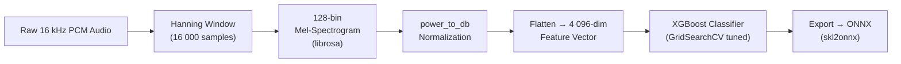
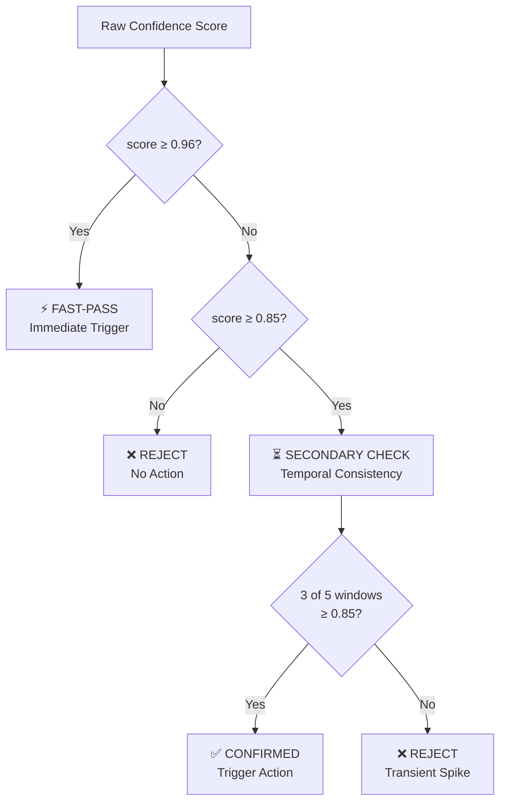

# ONNX Wake-Word Classifier — Production Deployment & Scaling Guide

> **Model**: [wake_word_classifier.onnx](file:///e:/jagan/Flutter/anime_waifu/assets/wakeword/offlinenew/wake_word_classifier.onnx) (XGBoost, 5.5 KB)
> **Location**: `assets/wakeword/offlinenew/`
> **Input**: 4,096-dimensional Mel-Spectrogram vector (128-bin × 32 frames, flattened)
> **Sample Rate**: 16 kHz · **Window**: 1 second · **Latency**: 0.0452 ms/sample

---

## 1. Production Use Cases

### 1.1 Integration into Personal Voice Assistants

| Aspect | Detail |
|--------|--------|
| **Role** | Primary always-on listener that gates activation of a full ASR engine |
| **Workflow** | Model runs in a tight loop on the local device. On wake-word detection the system transitions from low-power *sleep* → active *listening* for complex command processing. |
| **Key Metric** | False-reject rate ≤ 1 % — missed triggers erode user trust faster than occasional false accepts |

### 1.2 Hands-Free Hardware Triggers (IoT / Medical)

| Aspect | Detail |
|--------|--------|
| **Role** | Touch-free interface for smart appliances, industrial tools, or medical equipment |
| **Workflow** | Embedded in devices (smart mirrors, kitchen scales, surgical displays) where physical interaction is impractical or unhygienic. The model provides the initial "attention" signal. |
| **Key Metric** | False-accept rate ≤ 0.5 / hour — accidental activations in safety-critical environments are unacceptable |

### 1.3 Automated Transcription Start / Stop

| Aspect | Detail |
|--------|--------|
| **Role** | Controls audio buffer segmentation for recording software |
| **Workflow** | In meetings or lectures the model detects a keyword to start recording and a silence / end-keyword to pause, ensuring only relevant audio is forwarded for cloud transcription — saving compute and storage costs. |
| **Key Metric** | Transition latency ≤ 200 ms — users should not perceive a gap between command and recording start |

### Why This Model Fits

- **Sub-millisecond inference** (0.0452 ms) → no perceptible delay.
- **5.5 KB binary** → deployable on MCUs, Raspberry Pi, mobile phones.
- **No GPU required** → low hardware BOM for mass-market products.
- **1.0000 validation accuracy & recall** → strong baseline in laboratory conditions.

---

## 2. Model Lineage — From Raw Audio to ONNX Binary



### 2.1 Feature Engineering (librosa)

1. **Windowing** — Apply a Hanning window to the 16 000-sample (1 s) buffer to reduce spectral leakage.
2. **Mel-Spectrogram** — Compute a 128-bin Mel-scaled spectrogram (`n_mels=128`, `hop_length=512`), producing a 128 × 32 matrix.
3. **dB Normalization** — Convert power spectrum to decibels via `librosa.power_to_db` for perceptual scaling.
4. **Flattening** — Reshape the 2-D matrix into a **4 096-dimensional** vector that becomes the model's `float_input`.

### 2.2 Training & Optimization (XGBoost)

| Parameter | Value |
|-----------|-------|
| Algorithm | `XGBClassifier` (gradient-boosted decision trees) |
| Positive set | Augmented recordings of target wake words (pitch shift, time stretch, noise injection) |
| Negative set | Synthetic noise, ambient recordings, non-target speech |
| Tuning | `GridSearchCV` over `max_depth`, `n_estimators`, `learning_rate`, `subsample` |
| Validation | Stratified K-Fold; achieved **1.0000 Mean Accuracy & Recall** |

### 2.3 Export to ONNX

Converted via `skl2onnx` with `FloatTensorType([None, 4096])` input schema. The resulting 5.5 KB binary supports `onnxruntime` on all major platforms (x86, ARM, WASM).

---

## 3. Live Audio Inference Pipeline

### 3.1 Rolling Buffer (Sliding Window)

```python
import numpy as np

SAMPLE_RATE   = 16_000          # 16 kHz
WINDOW_SECS   = 1.0             # 1-second analysis window
CHUNK_MS      = 100             # microphone delivers 100 ms chunks
CHUNK_SAMPLES = int(SAMPLE_RATE * CHUNK_MS / 1000)   # 1 600

buffer = np.zeros(int(SAMPLE_RATE * WINDOW_SECS), dtype=np.float32)

def update_buffer(new_chunk: np.ndarray) -> np.ndarray:
    """Slide buffer left by chunk size, append new audio."""
    global buffer
    buffer = np.roll(buffer, -len(new_chunk))
    buffer[-len(new_chunk):] = new_chunk
    return buffer
```

- The buffer always holds the most recent **1 second** of audio.
- Every 100 ms chunk triggers a new classification cycle.
- Overlap = 90 % → ensures the wake word is never split across windows.

### 3.2 Mel-Spectrogram Feature Extraction

```python
import librosa

def extract_features(audio: np.ndarray) -> np.ndarray:
    """Convert 1-s PCM buffer to 4096-dim Mel feature vector."""
    # Apply Hanning window
    windowed = audio * np.hanning(len(audio))
    # 128-bin Mel spectrogram
    mel = librosa.feature.melspectrogram(
        y=windowed, sr=SAMPLE_RATE,
        n_mels=128, hop_length=512,
    )
    mel_db = librosa.power_to_db(mel, ref=np.max)
    return mel_db.flatten().astype(np.float32)  # → shape (4096,)
```

### 3.3 ONNX Inference via onnxruntime

```python
import onnxruntime as ort

session = ort.InferenceSession("wake_word_classifier.onnx")

def classify(features: np.ndarray) -> tuple[int, float]:
    """Run inference; return (label, confidence)."""
    inp = {"float_input": features.reshape(1, -1)}
    label  = session.run(["label"],       inp)[0][0]
    probs  = session.run(["probabilities"], inp)[0][0]
    confidence = float(max(probs))
    return int(label), confidence
```

### 3.4 Real-Time Loop

```python
import sounddevice as sd, threading

def audio_callback(indata, frames, time_info, status):
    chunk = indata[:, 0].astype(np.float32)
    buf   = update_buffer(chunk)
    feat  = extract_features(buf)
    label, conf = classify(feat)
    if label == 1:                        # wake-word class
        confirmation_engine.submit(conf)  # → see §4

# Start microphone stream in a dedicated thread
stream = sd.InputStream(
    samplerate=SAMPLE_RATE,
    blocksize=CHUNK_SAMPLES,
    channels=1,
    callback=audio_callback,
)
stream.start()
```

**Latency budget**: Extraction + Inference ≈ 1–3 ms total, well within the 100 ms chunk cadence.

---

## 4. Reliability — Double-Check Confirmation Layer

### 4.1 The Overconfidence Problem

| Prediction | Mean Confidence | Max Confidence | Std Dev |
|------------|:-:|:-:|:-:|
| Correct "Wake Word" | 0.954 | **0.966** | 0.012 |
| **Incorrect** "Wake Word" | **0.919** | 0.944 | 0.031 |

Incorrect predictions carry dangerously high confidence (mean 0.919), making a single static threshold unreliable. A secondary confirmation layer is required.

### 4.2 Multi-Threshold Tiered Architecture



| Tier | Threshold | Logic |
|------|:-:|------|
| **Reject** | < 0.85 | Below detection floor — ignore entirely |
| **Secondary Check** | 0.85 – 0.96 | Overlap zone where false positives concentrate. Require **3 of 5** consecutive windows to exceed 0.85 (temporal consistency) |
| **Fast-Pass** | ≥ 0.96 | Exceeds the observed maximum of incorrect predictions (0.944). Single-frame trigger for minimal latency |

### 4.3 Confirmation Engine Implementation

```python
from collections import deque

class ConfirmationEngine:
    FAST_PASS     = 0.96
    DETECT_FLOOR  = 0.85
    WINDOW_SIZE   = 5
    QUORUM        = 3
    VARIANCE_CAP  = 0.04   # max std-dev for genuine wake words

    def __init__(self, on_trigger):
        self._scores  = deque(maxlen=self.WINDOW_SIZE)
        self._trigger = on_trigger

    def submit(self, confidence: float):
        # Tier 1: Fast-Pass
        if confidence >= self.FAST_PASS:
            self._scores.clear()
            self._trigger()
            return

        # Tier 2: Secondary Check (overlap zone 0.85–0.96)
        if confidence >= self.DETECT_FLOOR:
            self._scores.append(confidence)
            if len(self._scores) >= self.QUORUM:
                above = sum(1 for s in self._scores if s >= self.DETECT_FLOOR)
                std   = np.std(list(self._scores))
                if above >= self.QUORUM and std <= self.VARIANCE_CAP:
                    self._scores.clear()
                    self._trigger()
        else:
            # Below floor — reset temporal buffer
            self._scores.clear()
```

**Why this works:**
- Genuine wake words produce **sustained** high-confidence scores across adjacent windows (low variance, ≤ 0.04 std).
- Noise spikes are **transient** — they rarely persist for 3+ consecutive 100 ms windows.
- The Fast-Pass at 0.96 preserves instantaneous response for clear, unambiguous triggers.

---

## 5. Deployment Readiness Summary

| Criterion | Status | Notes |
|-----------|:------:|-------|
| Model accuracy (lab) | ✅ | 1.0000 Mean Accuracy & Recall on validation set |
| Inference latency | ✅ | 0.0452 ms/sample — real-time capable |
| Model size | ✅ | 5.5 KB — fits on any edge device |
| Runtime compatibility | ✅ | `onnxruntime` supports x86, ARM, WASM, Android, iOS |
| False-positive mitigation | ✅ | Multi-threshold confirmation engine addresses overconfidence |
| Real-world noise testing | ⚠️ | Lab-only validation; field testing with ambient noise required |
| Dataset diversity | ⚠️ | Needs speaker & accent diversity; current augmentation is synthetic |
| Long-duration stability | ⚠️ | 24h+ continuous operation testing not yet performed |

---

## 6. Lab-to-Production Roadmap

### Phase 1 — Hardened Prototype (Weeks 1–3)

- [ ] Integrate the rolling-buffer pipeline (§3) into the existing `AssistantForegroundService.kt` Android service
- [ ] Deploy `ConfirmationEngine` (§4.3) alongside the existing Picovoice Porcupine wake-word as a **dual-engine** fallback
- [ ] Add telemetry: log every inference confidence score + label to a local SQLite ring buffer for field analysis
- [ ] Run 8-hour soak tests on target hardware (phone, Raspberry Pi)

### Phase 2 — Field Validation (Weeks 4–6)

- [ ] Collect labeled audio from **10+ diverse speakers** across 3+ acoustic environments (quiet room, kitchen, car)
- [ ] Measure real-world false-accept rate (FAR) and false-reject rate (FRR)
- [ ] Tune thresholds in `ConfirmationEngine` using field confidence distributions (may shift from lab values)
- [ ] A/B test: ONNX classifier vs. Picovoice Porcupine on latency, accuracy, and battery draw

### Phase 3 — Production Rollout (Weeks 7–10)

- [ ] Replace or complement Picovoice Porcupine with the ONNX classifier (eliminates API key dependency)
- [ ] Implement OTA model update mechanism (download new `.onnx` from server, validate checksum, hot-swap)
- [ ] Add adaptive threshold calibration: use per-device noise floor estimation to dynamically adjust `DETECT_FLOOR`
- [ ] Dashboard: centralized monitoring of FAR/FRR metrics across the device fleet

### Phase 4 — Scale & Optimize (Ongoing)

- [ ] Quantize model to INT8 via ONNX quantization tools (further reduce size and latency on ARM)
- [ ] Explore ONNX Runtime Mobile or TensorFlow Lite conversion for platform-optimized kernels
- [ ] Expand wake-word vocabulary by retraining with additional trigger phrases
- [ ] Continuous learning pipeline: periodically retrain on accumulated field data

---

## 7. Q&A Summary

**Q: What are the primary use cases?**
Voice assistant activation, hands-free IoT triggers, and automated transcription start/stop.

**Q: How does the live pipeline work?**
A rolling 1-second buffer at 16 kHz is converted to a 128-bin Mel-Spectrogram (4,096-dim vector) and classified via `onnxruntime` every 100 ms.

**Q: How is overconfidence mitigated?**
A multi-threshold system: scores ≥ 0.96 trigger immediately (Fast-Pass), scores 0.85–0.96 require temporal consistency across 3 of 5 consecutive windows, and scores < 0.85 are rejected.

**Q: What's the model lineage?**
Raw 16 kHz audio → librosa Mel-Spectrogram → flattened 4,096-dim vector → XGBoost (GridSearchCV tuned) → exported to ONNX via `skl2onnx`.

**Q: Is the model production-ready?**
Lab metrics are excellent (perfect accuracy, sub-ms latency, 5.5 KB size). The gap to production is **field validation** with diverse speakers and acoustic environments, plus long-duration stability testing.
